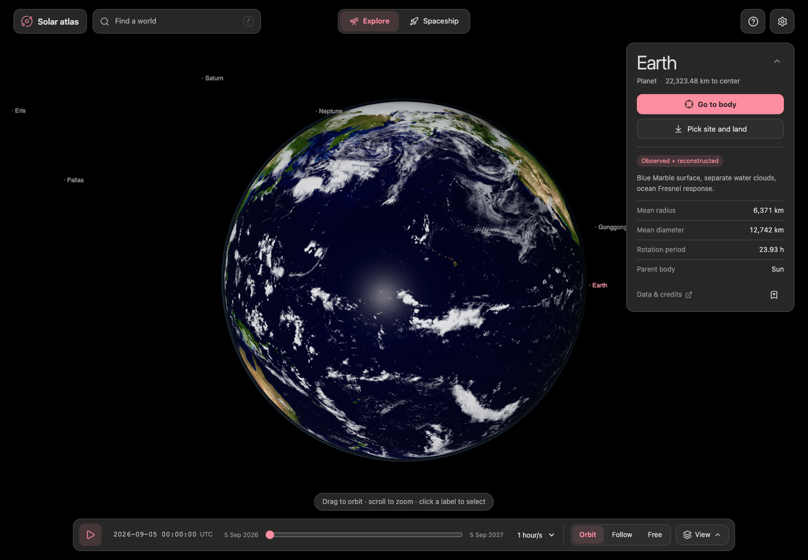
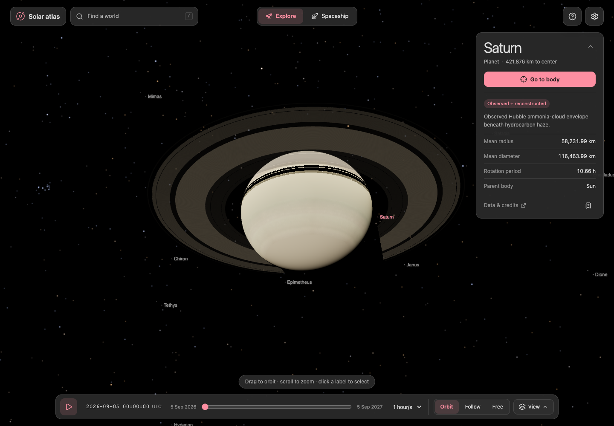
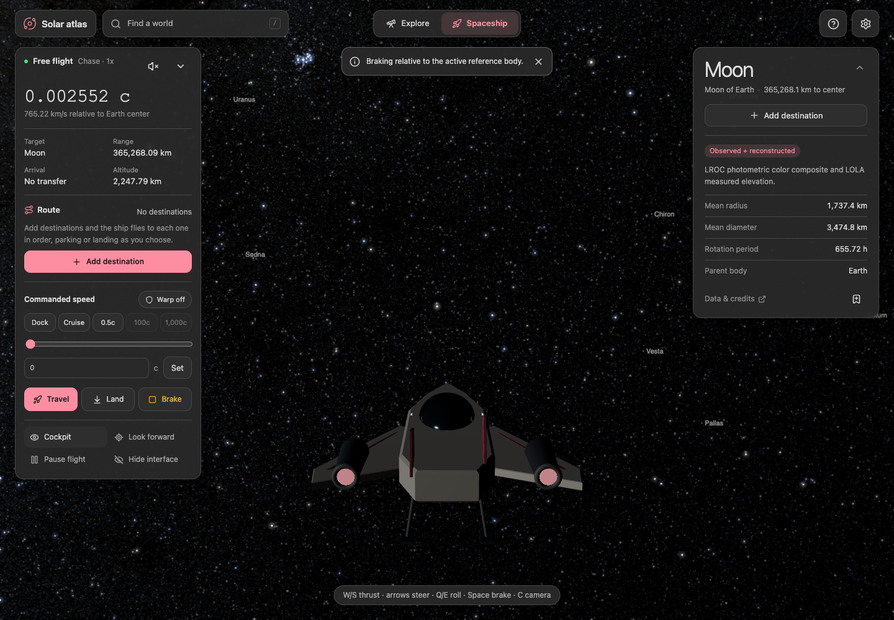
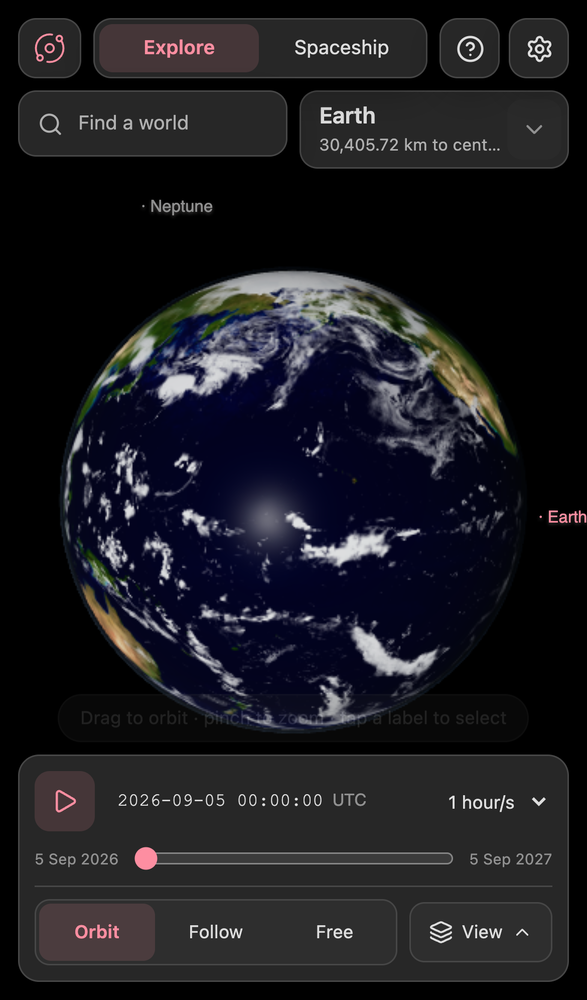

# Solar Atlas

A browser solar-system explorer covering 71 bodies, seven ring systems, physical dimensions, source records, and a cached year of JPL motion data.

Meshes and maps are converted ahead of time, so no modeling tool is a runtime dependency. `npm run build` writes the release to `dist/` with its data and assets included.



## Screenshots

<table>
	<tr>
		<td></td>
		<td></td>
	</tr>
	<tr>
		<td align="center"><sub>Explore Saturn and its ring system</sub></td>
		<td align="center"><sub>Fly in cockpit or chase view</sub></td>
	</tr>
	<tr>
		<td colspan="2" align="center">
			<br>
			<sub>Responsive phone layout with touch controls</sub>
		</td>
	</tr>
</table>

## Run the release

```sh
npm ci
npm run build
npm run preview
```

Open the address the preview server prints and append `?scoutTheme=dark` for the dark theme. Stop the server with Ctrl+C.

Serve the release over HTTP. Opening the page straight from disk fails, because browsers restrict local-file fetches, workers, and model loading. No account, external API, or CDN is needed at runtime.

To host the app, upload the entire `dist/` directory to a static HTTPS host. Keep the directory layout intact. Assets load on demand, so visiting every body transfers more data than opening the initial Earth view.

## Explore

Open Find a world or press `/` to search the catalog. Enter jumps to the first match, and the arrow keys move through the list. You can also select a body label in the scene. Drag to orbit and scroll or pinch to zoom.

The body card on the right shows the selected body, its distance, and its physical facts. Go to body moves the camera there instantly. The chevron hides the facts when you want more of the scene.

The bottom dock holds the timeline, the camera modes, and the View menu. View frames the local, inner, or whole solar system without compressing distances. It also shows or hides body labels and trajectory lines, which are annotations. Follow keeps the selected body centered. Free camera retains an inertial reference and supports W/S forward movement, A/D lateral movement, and R/F vertical movement.

The timeline starts paused. Play, reverse, scrub, and pick a time rate such as 1 hour/s in Explore mode. Select the date to type an exact UTC time. The source interval spans September 5, 2026 through September 5, 2027. Playback stops at either boundary.

The bookmark button on the body card saves the body and the simulation date. Saved viewpoints appear under the Saved filter in the catalog.

## Fly

Enter Spaceship to use an original three-dimensional cockpit or the external chase camera. Flight starts at 1x simulation time.

| Control | Action |
| --- | --- |
| W / S | Forward / reverse thrust |
| Arrow keys | Pitch and yaw |
| A / D | Yaw |
| Q / E | Roll |
| R / F | Vertical thrust |
| Space | Brake |
| P | Pause or resume flight |
| C | Cockpit or chase view |
| M | Space music on or off |
| + | Add the selected body to the route |
| G | Start, resume, or depart on the route |
| Drag the viewport | Cockpit free-look |
| Touch pads and buttons | Steering, look, roll, vertical thrust, and braking on phone/tablet |

The flight panel groups speed, target, and actions. Its chevron collapses it to a strip that keeps Travel, Land, and Brake, so the cockpit instruments stay visible. On a phone the panel starts collapsed above the touch pads. Expanding it pauses the touch pads until you collapse it again.

Use the numeric speed field, logarithmic slider, or presets to set commanded speed. Actual speed reports motion relative to the displayed reference body's center. A landed ship can have nonzero speed because the planet rotates beneath that reference frame. A reference change does not teleport the ship.

`c = 299,792.458 km/s`. Conventional mode remains below c. Enable Warp explicitly to allow speeds through 1,000c. Warp is fictional and is limited near hazards. Turning it on inside a body's exclusion zone arms it instead, and it engages once the ship is clear. During an assisted transfer, warp pauses while the ship passes another body and resumes after it. It drops for good at the destination. The displayed c value is per simulated second, not a hidden time-acceleration multiplier.

Select a destination and choose Travel for assisted transfer. The controller steers toward the moving target and brakes for approach. If another body's exclusion zone blocks the straight line, the course bends around that zone. Arrival time is an estimate. Cancel autopilot returns control without teleporting. Brake stops motion relative to the reference body.

### Routes

A route strings several destinations into one trip. In Spaceship mode, add a destination with the + button beside each body in the catalog, the Add destination button on the body card, or the + key for the selected body. The Route section of the flight panel lists stops in order. Each stop either parks nearby or lands (hovers on the giant planets), and you can move stops earlier or remove them.

Start route (or G) flies to the first stop. After each arrival the ship waits five seconds, takes off if it landed, and heads for the next stop. Turn off Auto-continue to leave each stop yourself with Depart now. Auto speed sets each leg's commanded speed so the cruise takes about 30 seconds within the current Warp setting. Legs between planets need Warp, and the route tells you when a leg would take more than a few minutes below c. Pause route brakes the ship, Skip stop moves on, and any manual Travel, Land, or Take off pauses the route. Fly again restarts a finished route.

Pausing freezes translation while leaving the interface and free-look usable. A hidden tab pauses the simulation instead of applying a large elapsed-time jump. Leave flight before scrubbing or reversing time.

### Music

Space music plays an ambient soundtrack while you fly. Turn it on in Settings, with the speaker button at the top of the expanded flight panel, or with M. It starts off, and Settings remembers the choice and the volume.

Nothing is downloaded. Your browser synthesizes the music with the Web Audio API: a low drone on D, slow pad chords in D Lydian, and sparse bell chimes, all through a generated reverb. The chord changes every 16 seconds and a random walk picks the chimes, so there is no loop to notice.

The mix follows the ship. Faster flight opens the filter on the pads. Warp adds a high shimmer. Landing or hovering leaves only a quieter drone. Pausing flight, hiding the tab, or leaving Spaceship mode fades the music out, and the audio stops a few seconds later.

Browsers play sound only after you interact with the page. If music was on during your last visit, it starts with your first click or key press.

## Land

Select a solid body and choose Land. The ship approaches, aligns, and descends with assistance. Once landed, it retains a body-local pose as the world rotates and travels through its orbit. Take off lifts off at 10 m/s and speeds up as it climbs, so it clears the local surface in a few seconds before normal flight resumes.

In Explore mode, Pick site and land on the body card lets you select a visible part of the source mesh and launch a descent there. Collapse the flight panel to see the cockpit instruments, and adjust field of view in Settings.

Jupiter, Saturn, Uranus, and Neptune offer simulated atmospheric hovering. They do not have solid landing sites in this app. The Sun cannot be landed on.

Surface detail beyond the source mesh and maps is reconstructed. Bounded local terrain does not replace catalog radii or alter the authoritative scientific records. The same local geometry drives collision, surface altitude, and landing visuals. This is an exploration aid, not a terrain-navigation product.

## Stars

The sky behind the bodies holds about 1.49 million stars down to magnitude 11.5, plus the diffuse light of the Milky Way. Stars are scenery. You can't select, label, or fly to them.

The 41,075 stars brighter than V 8 come from the Hipparcos-2 reduction, with V magnitudes and B-V colors from the original Hipparcos catalog. Eighteen bright stars that Hipparcos-2 lacks, Eta Carinae among them, come from the Yale Bright Star Catalogue. Each of these stars moves by its proper motion from the 1991.25 Hipparcos epoch to the simulation date. Stars with a parallax also shift with the camera's position, so a long warp flight visibly moves Alpha Centauri. Inside 50 AU no star moves more than 40 arcseconds.

The 1.44 million fainter stars come from Tycho-2. Their positions are fixed at 2027.0, which keeps the fastest of them, Barnard's star, within 7 arcseconds across the whole simulation year. They load after the bright stars. Low quality stops at V 10 and uses a 2K Milky Way map. High quality adds the 1.13 million stars from V 10 to 11.5 and a 4K map.

Behind the stars sits the Milky Way map from NASA's Deep Star Maps 2020. It holds the Gaia DR2 starlight fainter than Tycho-2, so the band, its dark lanes, the Coalsack, and the Magellanic Clouds keep their measured brightness relative to the resolved stars.

The display imitates a long-exposure photograph and was tuned against a Milky Way photo taken by the Artemis II crew. At 0 EV a V 4 star just reaches white. Brighter stars grow a saturated core and a faint glow. Colors come from each star's B-V index under a 4800 K white balance. Exposure compensation in Settings changes the stars and the Milky Way by the same EV as the bodies. A narrower field of view shows brighter stars against a dimmer Milky Way, as a longer lens would.

With the Sun in view, glare hides the stars and the Milky Way. Near 1 AU it dims them by about 9 magnitudes, and it weakens with the square of the distance from the Sun. A camera lens flare shows where the glare comes from. It has six diffraction spikes, fine streaks, and faint hexagonal ghosts on the line from the Sun through the middle of the screen. The flare follows the same glare term, so it is brightest where the stars vanish and fades out beyond Neptune. A planet, a moon, or a cockpit pillar in front of the Sun cuts both by the share of the solar disc it covers.

Settings has two switches for this, both on by default. Lens flare from the Sun turns the flare off. Turning off Sun glare hides stars keeps the stars and the Milky Way visible next to the Sun.

Daylight works separately, and neither switch changes it. Inside the atmosphere of Earth, Mars, Titan, or a giant planet, daylight hides the stars until the Sun sinks 18 degrees below the horizon. Under Venus's cloud deck they never show.

## Keyboard shortcuts

These work anywhere outside a text field. The flight keys are listed under Fly.

| Key | Action |
| --- | --- |
| / | Search worlds |
| Space | Play or pause time in Explore |
| P | Play or pause time, or pause flight |
| 1 / 2 / 3 | Orbit, Follow, or Free camera |
| L | Body labels |
| T | Trajectory lines |
| C | Cockpit or chase view |
| H | Hide or show the interface |
| ? | Controls and help |
| Esc | Close the open menu or catalog, or bring the interface back |

Hide interface clears every panel for an unobstructed view and leaves one Show interface button. Touch screens reach it from the View menu in Explore and from the flight panel in Spaceship.

## What is retained

- All body IDs, names, categories, parent relationships, adopted radii, semiaxes, physical notes, and citations.
- All cached double-precision position and velocity samples, including the quarter-hour Phobos refinement.
- Supported secular orientation models, retrograde rotations, ring poles, and unconstrained-phase caveats.
- All seven ring systems and their 37 bands, radii, representative optical depths, and references.
- Source-derived geometry, UV registration, prepared observed maps, compatible procedural bakes, cloud/atmosphere dimensions, and image credits.

CPU calculations use double-precision ICRF kilometers. The renderer subtracts the observer position before GPU transforms. Distant render proxies preserve angular size and direction rather than enlarging planets. Smaller textures and geometry detail levels reduce device load without changing stored physical dimensions.

## Scientific limits

Horizons states are simultaneous geometric positions relative to the Solar System barycenter. They are not apparent positions corrected for light travel. Interpolation uses source velocities and actual sample epochs. It never extrapolates beyond the cached interval.

Most bodies use hourly samples. Phobos uses 15-minute samples. The source measured about 49 m maximum error at selected independent Phobos test epochs. That result is not a universal accuracy guarantee. Source ephemeris uncertainty remains separate from interpolation and renderer error.

Orientations are approximate secular IAU models. The source omits periodic terms and detailed Earth orientation. Unknown rotations and texture phases remain unconstrained. UTC labels use a pinned leap-second table.

Observed imagery can combine multiple dates and reconstructed coverage. Clouds and weather maps are not forecasts for the selected date. Shaders approximate illumination, atmospheres, and eclipses rather than reproducing Blender Cycles ray tracing.

One-year trajectory lines are cached tracks. They are not fabricated complete orbits for bodies with longer orbital periods. This expanded catalog is not a complete Solar System census.

Hipparcos and Tycho-2 positions are ICRS. Stellar aberration, radial velocity, binary orbits, and variability are left out, and variable stars keep one catalog magnitude. Tycho-2 V and B-V are converted from its own VT and BT bands. Tycho-2 stars have no parallax, and their packed directions round by up to 13 arcseconds. The Milky Way map has no parallax either, and it holds only starlight, so the Carina Nebula shows its stars but not its glowing gas. The tone curve, zoom rule, glare, lens flare, and twilight scales are display choices, not a calibrated eye or camera model.

No n-body spacecraft dynamics, fuel accounting, relativistic optics, live ephemeris refresh, multiplayer, VR, or surface walking is included. The ship, cockpit, flight controls, and added terrain are exploration features, not measured scientific data.

## Develop

```sh
npm ci
npm run dev
npm run typecheck
npm test
npm run build
npm run test:browser
```

Source and rendering contracts live in `src/contracts.ts`. Conversion and export scripts live in `scripts/`. Scientific inputs come from the upstream records listed in `CREDITS.md`; generated output belongs to this app.

`npm run prepare:stars` rebuilds `public/assets/stars/`. It needs Python with numpy and Pillow. It downloads 266 MB of catalogs from CDS and the Milky Way EXR from NASA SVS into `~/.cache/solar-atlas-stars`, and refuses any file that doesn't match its pinned SHA-256. Pass `-- --offline` to build from the cache alone. Two runs produce identical files.

The browser suite uses installed Google Chrome through Playwright. It exercises desktop and emulated phone viewports. Emulated touch tests do not establish performance on a physical phone. Runs write screenshots and a JSON report to `artifacts/`, which is not tracked.

## Credits

The in-app Data & credits panel exposes the original catalog, orientation records, and per-image asset manifest. Read `CREDITS.md` for acknowledgments. Bundled manifests retain exact source URLs, usage terms, processing notes, and registration qualifications.

## License

The application code is MIT licensed. Read `LICENSE`.

The MIT grant does not extend to the bundled scientific data and imagery under `public/data/` and `public/assets/`. Those files keep the terms recorded in `CREDITS.md` and in the per-asset manifest, which include NASA source terms and CC BY 4.0 attribution requirements. Check the manifest before redistributing any map.

The Hipparcos and Tycho-2 star files are CC BY-NC 3.0 IGO, which rules out commercial use. A commercial fork has to replace `public/assets/stars/`.

## Repository size

`public/` holds about 548 MB of committed meshes, textures, star catalogs, and cached ephemeris. The Blender project the assets are exported from is vendored under `blender/` and adds another 626 MB, including a 374 MB `.blend` file.

Meshes, textures, the `.blend`, `states.bin`, and the gzipped ephemeris are stored in Git LFS. Install it before cloning, or you get pointer files instead of assets and the app fails to load:

```sh
brew install git-lfs   # or your platform's package manager
git lfs install
git clone https://github.com/abhi-singhs/solar-atlas.git
```

If you already cloned without LFS, run `git lfs pull`. Add `--depth 1` to the clone if you do not need history. Screenshots under `docs/screenshots/` stay outside LFS so they render on GitHub.
